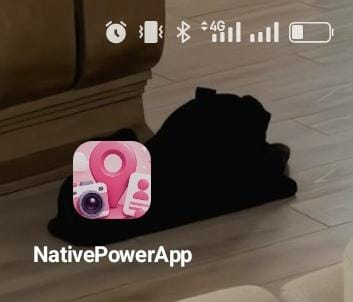
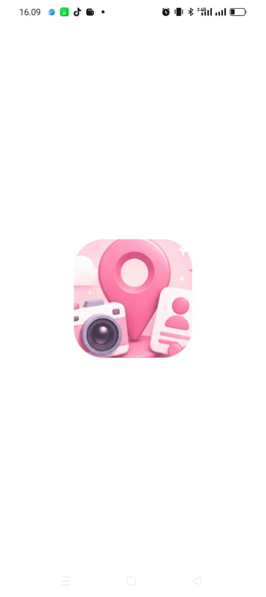
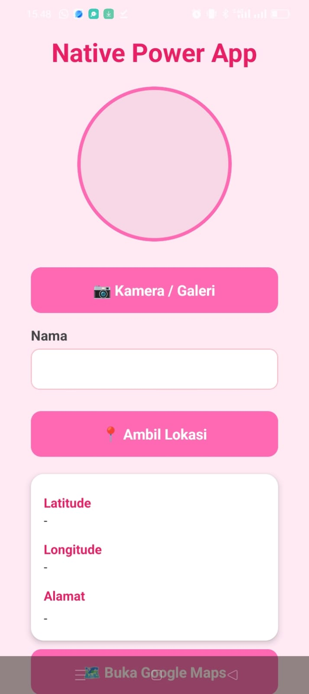
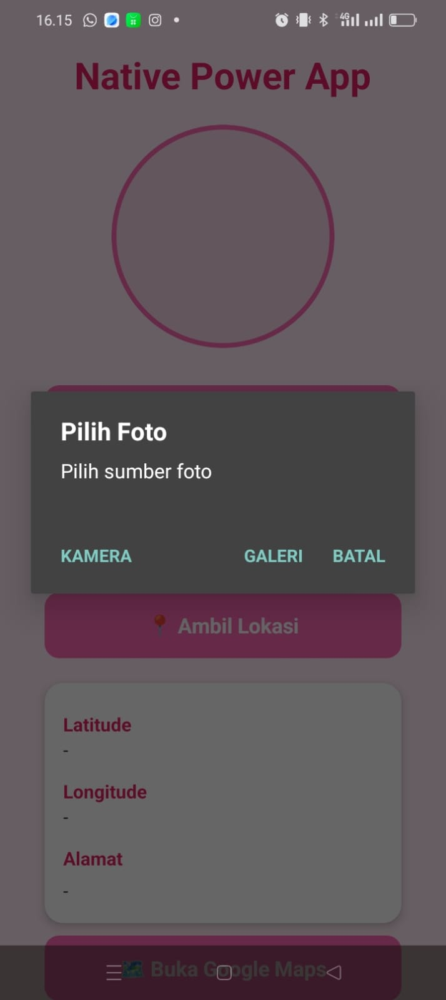
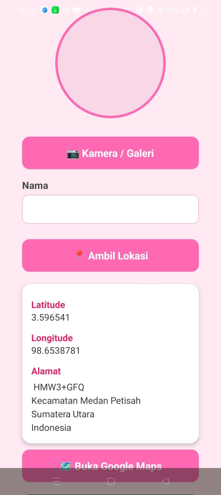
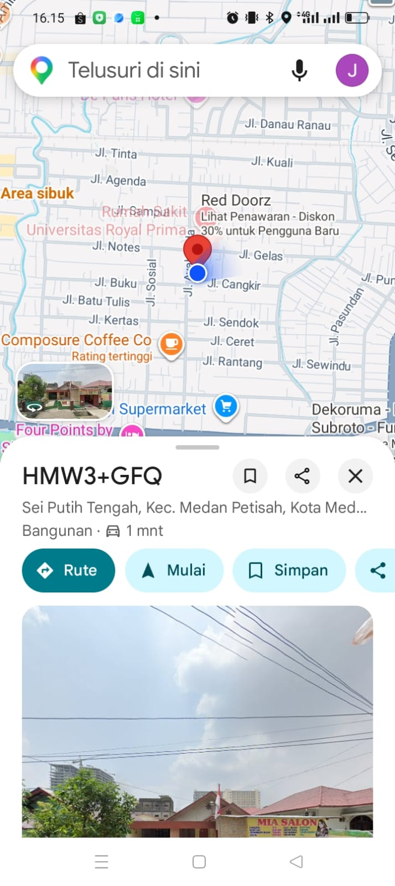
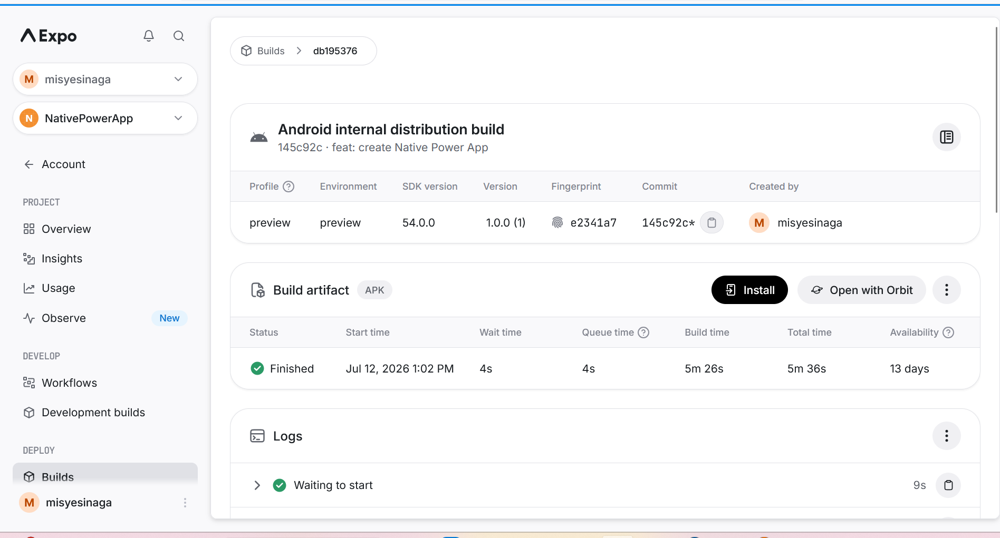

# NativePowerApp 📸📍

Aplikasi mobile native berbasis Expo yang mengintegrasikan fitur **kamera, galeri, dan GPS** dalam satu alur kartu profil digital. Dibangun sebagai bagian dari Mission P13 (Native Power App) dan dilanjutkan ke Mission P14 (Ship It!) untuk proses build & rilis APK.

## 📱 Deskripsi Singkat

App ini adalah **kartu profil digital dengan foto dan lokasi**, fitur utamanya: mengambil foto profil (lewat kamera atau galeri), menangkap lokasi pengguna secara otomatis (GPS + reverse geocoding jadi alamat), dan membuka lokasi tersebut langsung di Google Maps.

## ✨ Fitur Utama

| Fitur | Status |
|---|---|
| 📷 Ambil foto via **Kamera** | ✅ |
| 🖼️ Pilih foto via **Galeri** | ✅ |
| 📍 Ambil **lokasi GPS** (latitude & longitude) | ✅ |
| 🏠 **Reverse geocoding** — koordinat otomatis jadi alamat | ✅ (bonus) |
| 🗺️ Tombol **Buka di Google Maps** | ✅ |
| 🔐 Permission flow (request izin → cek status → handle penolakan) | ✅ |

## 🍬 Coba Online (Expo Snack)

Mau coba app ini tanpa install APK dulu? Buka lewat Expo Snack:

**[▶️ Buka di Expo Snack](https://snack.expo.dev/@misyesinaga/nativepowerapp_p14)**

> Catatan: fitur kamera & GPS baru berfungsi penuh kalau dites lewat **Expo Go** di HP (scan QR code dari halaman Snack). Preview langsung di browser tidak bisa akses kamera/GPS asli perangkat.

## 🛠️ Tech Stack

- **React Native** + **Expo** (SDK 54)
- `expo-image-picker` — akses kamera & galeri
- `expo-location` — GPS & reverse geocoding
- `expo-constants`
- **EAS Build** — build APK untuk distribusi Android
- **AsyncStorage** *(jika dipakai untuk persistensi)*

## 📥 Cara Install APK

1. Download APK dari link berikut (build EAS, profile `preview`):
   **[⬇️ Download APK](https://expo.dev/accounts/misyesinaga/projects/NativePowerApp/builds/db195376-768a-4188-89ca-b87ed2457fdb)**
2. Di HP Android, buka file APK yang sudah didownload
3. Kalau muncul peringatan "Install dari sumber tidak dikenal", aktifkan izinnya lewat **Settings** yang muncul
4. Tap **Install**, tunggu selesai, lalu buka aplikasinya

> ⏳ **Catatan:** Link APK dari EAS aktif selama 30 hari sejak build selesai. Kalau link sudah expired, build ulang dengan `eas build --platform android --profile preview`.

## 🍬 Coba Online via Expo Snack

Ingin coba tanpa clone/install project? Buka versi interaktifnya langsung di browser:

**[▶️ Buka di Expo Snack](https://snack.expo.dev/@misyesinaga/nativepowerapp_p14)**

> ⚠️ Fitur kamera & GPS memerlukan akses hardware asli — buka Snack ini di HP dan scan QR-nya lewat aplikasi **Expo Go** agar fitur native berfungsi penuh. Preview langsung di browser desktop hanya menampilkan UI-nya saja.

## 🚀 Menjalankan Project (Development)

```bash
git clone https://github.com/misyesinaga1-alt/NativePowerApp-P14.git
cd NativePowerApp-P14
npm install
npx expo start
```
Scan QR code yang muncul menggunakan aplikasi **Expo Go** di HP Android/iOS.

Untuk build APK sendiri:
```bash
eas build --platform android --profile preview
```

## 📸 Screenshot

### Icon Aplikasi & Splash Screen
| Icon di Home Screen | Splash Screen |
|---|---|
|  |  |

### Halaman Utama Aplikasi


### Fitur Kamera & Galeri
Dialog pilihan sumber foto muncul saat tombol "Kamera / Galeri" ditekan:



### Fitur Lokasi (GPS + Reverse Geocoding)
Latitude, longitude, dan alamat otomatis terisi setelah menekan "Ambil Lokasi":



### Fitur Buka di Google Maps
Lokasi yang diambil bisa langsung dibuka di Google Maps:



### Bukti Proses Build (EAS Dashboard)
Status build **Finished**, profile `preview`, versi `1.0.0 (1)`:



## 🔗 Link Penting

- **Repository:** https://github.com/misyesinaga1-alt/NativePowerApp-P14
- **Download APK:** https://expo.dev/accounts/misyesinaga/projects/NativePowerApp/builds/db195376-768a-4188-89ca-b87ed2457fdb
- **EAS Build Dashboard:** https://expo.dev/accounts/misyesinaga/projects/NativePowerApp/builds/db195376-768a-4188-89ca-b87ed2457fdb
- **Expo Snack (coba online):** https://snack.expo.dev/@misyesinaga/nativepowerapp_p14
- **Expo Snack (coba online):** https://snack.expo.dev/@misyesinaga/nativepowerapp_p14

## 👤 Author

Misye Retno Wulansari Br Sinaga — Mission P13/P14, Native Mobile Development
